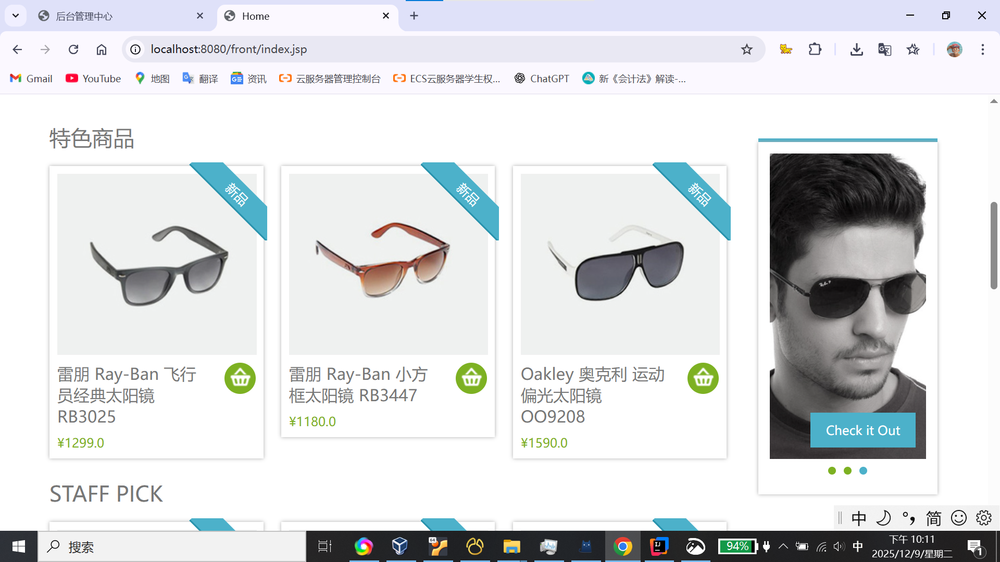

# JavaWeb-Shop(简易电商后台)

  

此项目为JSP课程作业
---
> ⚠️ 当前状态：部分后台商品管理功能尚在维护中，功能正在逐步完善中
- 老掉牙的JDBC和JSP+Servlet
- 重拾Java写后端
- 简易电商系统（前台+后台）

## 系统结构 / 技术栈

- 编程语言 / 运行环境： **Java**
- Web 技术： **Servlet**, **JSP**
- 数据库访问： **JDBC**
- 构建 / 管理工具： **Maven**（通过 `pom.xml` 管理依赖）
- 前端页面：HTML + CSS + JavaScript
---
## 使用说明

- 浏览商品 —— 前台页面展示商品列表／详情
- 登录后台（admin／管理端） —— 进入后台管理系统
- 后台管理 —— 添加 / 编辑 / 删除商品（如果后台功能完善的话）
- 后台管理 —— 添加、编辑、删除前端或后端用户
- 后台管理 —— 订单管理：查看并设置订单状态
- 前台购物／下单流程
- 后台管理超级用户账号admin密码123456
- 数据库文件位于SQL/db_shop.sql

## 未来计划 / TODO

- ✅ 完善后台商品管理功能（目前「正在完善中」）

## 贡献 & 联系方式

- 欢迎 fork / 提 issue / 提 PR —— 如果你对这个项目有改进想法 / 建议的话。
你也可以联系我（lyh526@foxmail.com）来看我其他项目 🙂
---

## 📦 小手编写bug中……
- 我也不想写博物馆级别的古董技术栈
- ChatGPT锐评：它真的老得发霉，但它就是你成为后端程序员必须经过的“原始森林”。
- Claude评价道：散发着 Dreamweaver 2005 气息
